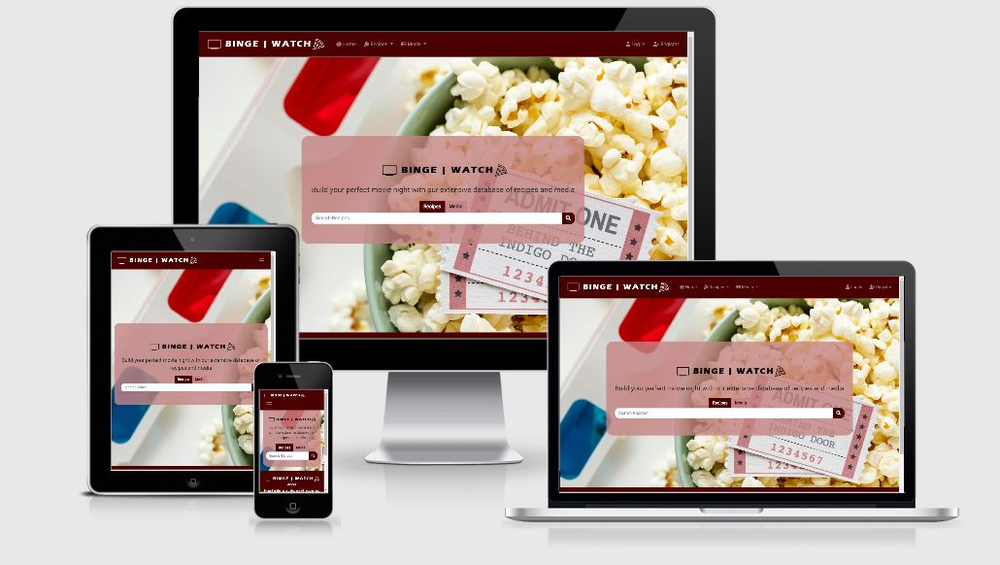

# Binge | Watch - Data Centric Development Milestone Project

App hosted at: [https://bingewatch-recipeapp.herokuapp.com/](https://bingewatch-recipeapp.herokuapp.com/)

This is an app designed to help people create their ideal movie night by combining collections of recipes and media such as film, TV and video games, and creating pairings and recommendations across the two collections. The app is also designed to allow users to register and login in order to create, edit and delete recipes and media records to allow them to contribute to the database and community.

## Contents

- [UX](#ux)
- [Technologies](#technologies)
- [Features](#features)
  - [Existing Features](#existing-features)
  - [Features Left to Implement](#features-left-to-implement)
- [Testing](#testing)
- [Deployment](#deployment)
  - [Local Deployment](#local-deployment)
  - [Heroku Deployment](#heroku-deployment)
- [Credits](#credits)
  - [Content](#content)
  - [Media](#media)
- [Acknowledgements](#acknowledgements)

## UX

My goal in the design and development of the app was to create a visually engaging and accessible way of storing and surfacing information relating to both recipes and media, as well as a place for users to build their own database of preferences for easy access in the future.

I also wanted to create a secure app, both in terms of the storage of user information and ensuring that access to certain functions was restricted to users only. This required a user login function to control access to certain pages, which was not something I had initially factored into the design and early development of the site. If I was to start the project from scratch, the user login would likely be one of the first functions that I would have included as it factors in to a number of the other functions included within the app - this would have saved time refactoring code at a later stage of the project.

It was also important that the app was responsive and easy to access and use on mobile devices, as it would be useful for users to be able to access lists of ingredients while they are shopping in the supermarket, for example. As such I ensured that the design of the app was mobile-first, and each design aspect was thoroughly tested on multiple virtual devices using Google Developer Tools.

I looked at existing recipe sites and apps for inspiration around the design and development of my own app, including [Food52](https://food52.com/ "Food52 homepage") which is built around creating a user-generated community of cooks and recipes, and the [BBC Good Food](https://www.bbcgoodfood.com/ "BBC Good Food homepage"), which I personally use on a regular basis and find easy to access.

I also looked at the Internet Movie Database or [IMDB](https://www.imdb.com/ "IMDB homepage") to understand the key pieces of information that people may search when looking for a film recommendation. This heavily informed the development of the media collection within my database, as I wanted to ensure that the key data was included.

A series of **User Stories** can be found in the [user-stories.md](https://github.com/TwelvePercentHero/bingewatch/blob/master/static/docs/user-stories.md) file.

A set of wireframes can be found [here](https://github.com/TwelvePercentHero/bingewatch/blob/master/static/docs/wireframes.pdf), mocked up using [Balsamiq](https://balsamiq.com/ "Balsamiq homepage"). The final design of the app remained largely similar to these mockups with a few small changes based on functionality.

## Technologies

I used the following technologies within my app.

- [Python3](https://www.python.org/ "Python homepage")
  - I used Python3 to develop all backend code and functions.
- [Flask](https://palletsprojects.com/p/flask/ "Flask documentation")
  - The Flask micro-framework was used to speed up development of the Python app and to construct and render pages.
- [MongoDB Atlas](https://www.mongodb.com/cloud/atlas "MongoDB Atlas homepage")
  - I elected to use MongoDB as my backend database as I found it easier to quickly manage and access multiple collections than with an SQL database.
- [PyMongo](https://api.mongodb.com/python/current/ "PyMongo documentation")
  - I used PyMongo as a tool for easily accessing my MongoDB database via Python code.
- [Flask-Uploads](https://pythonhosted.org/Flask-Uploads/ "Flask-Uploads documentation")
  - Flask-Uploads was used to more efficiently handle file uploads and storage for the purposes of uploading images for recipe and media records.
- [Werkzeug Security](https://werkzeug.palletsprojects.com/en/0.15.x/utils/ "Werkzeug Security documentation")
  - Werkzeug Security made password hashing easier and more effective for user authorisation. Initially I tried using Bcrypt but ultimately found that the Werkzeug tools included in the Flask micro-framework were more efficient.
- [Jinja2](http://jinja.pocoo.org/ "Jinja2 documentation")
  - I used Jinja2 to effectively display data from the backend database in HTML on the frontend.
- [HTML5](https://developer.mozilla.org/en-US/docs/Web/Guide/HTML/HTML5 "HTML5 documentation")
  - The project uses HTML5 for the overall structure and content of the website.
- [CSS3](https://developer.mozilla.org/en-US/docs/Web/CSS/CSS3 "CSS3 documentation")
  - The project uses CSS3 for the style and format of the website.
- [Bootstrap v4.3.1](https://getbootstrap.com/docs/4.3/getting-started/introduction/ "Bootstrap v4 documentation")
  - The project uses Bootstrap v4.3.1 for additional style and formatting options, including the grid system and mobile responsive elements. The Bootstrap jQuery script has also been included in the site to facilitate the section transitions.
- [jQuery](https://jquery.com/ "jQuery homepage")
  - jQuery was used in the project to handle certain transitions included creating additional fields on the add-recipe and add-media templates.
- [Google Fonts - Heebo](https://fonts.google.com/specimen/Heebo "Google Fonts - Heebo page")
  - I selected the Heebo font from Google Fonts due to its clean style and appearance across multiple devices.
- [FontAwesome Icons](https://fontawesome.com/icons?d=gallery "FontAwesome Icons list")
  - I used multiple icons from the free FontAwesome icons collection to make navigation around the app more visually appealing.

The project was initially built in **AWS Cloud9**, however this service became difficult to use as the application became larger with more templates, so ultimately I elected to use **Microsoft Visual Studio Code** instead, and found this a far more robust system for my needs.

## Features

The features of the app are designed to allow users to carry out a variety of actions as part of the User Stories listed in the user-stories.md file.

### Existing Features

**Responsive Navbar:** I used a responsive navbar from Bootstrap to allow ease of navigation around the site, ensuring first that it displayed as I intended on mobile devices. Considering the number of navigation options I wanted to include I knew that I needed to use a collapsible icon to expand the list on mobile devices, and I also wanted to include a brand component within the navbar to allow users to easily and clearly navigate back to the homepage regardless of which page they were currently on.

**Hero Image:** I wanted an image which evoked both films and food which could be used as a background image on all pages while still looking striking when used as a hero image on the homepage. The one that I found on [Pexels](https://www.pexels.com/ "Pexels homepage") under a **Creative Commons 2.0 license** fit the bill perfectly.

**Search Function:** The app includes a search query function for both recipes and media, which looks at the full text contained within a particular document as opposed to being limited to only searching the title or ingredients. While this works well for querying the database at its current size, it would likely increase load speeds significantly if the database were to scale up, so in future development it may be necessary to restrict the search query function to only search specific fields within the document.

**Browse Function:** I wanted to include an option for a user to browse the entire contents of a particular collection, so included the **get_recipes** and **get_media** functions to return a full list of results. While initially these all displayed on a single page, I ultimately decided to paginate the results to prevent load speeds from slowing down, and to ensure that the app was robust enough to support the database increasing in size over time.

**Filter Functions:** The ability to filter results based on certain criteria was an important part of all the databases I looked at as part of my user research, so I definitely wanted to include it as a feature. I chose some key pieces of information by which to filter the results and included drop-down menus for ease of user interaction. Initially the function built to effectively filter results was very long, totalling over 100 lines of code, but I was able to refactor this to a more manageable length, however I still decided to move this function into a separate Python file to reduce the size of my **app.py** file.

**Pagination:** The results pages for both recipes and media are paginated to show only 9 results per page, in an effort to reduce the amount of space taken up on screen and improve the overall aesthetic of the app. The steps taken to implement this are currently overcomplicated as the page displays a different set of 'Next' and 'Previous' buttons depending on whether the results are returned via an unfiltered browse, a filtered browse, or a search. This was put in place because the original pagination function was returning the correct first page of results for filtered and search queries, but defaulting to the unfiltered query for the second page as the request method was no longer set to POST. The method I ended up using, while not ideal, functions as expected and as such I decided to treat it as a minimum viable product with room for additional development in the future.

**Record Views:** The **recipe.html** and **media.html** templates display the individual recipes and media stored in the database. I included a large hero image at the top of the page to display the record in a visually appealing way, and split the rest of the page into columns to make the layout as compact and the information as accessible as possible.

I initially attempted to include numbers on each of the recipe method steps but ultimately decided that the layout was cleaner without them and they were not necessary for user interaction and understanding of the recipe method.

I also included links to related records on both templates - recommended media on the recipes page, and recommended recipes on the media page, based on certain filtering criteria. This was the initial purpose of the app, to allow people to find food and media pairing and so was a vital part of the project.

Each record also has the option to edit or delete, but these options are only accessible if the app detects that the user is currently logged in - if they are not, they will be directed to the **login.html** page with a flashed message advising that they need to be logged in to carry out the requested function.

**User Authorisation:** Although this did not figure into the initial planning stages of the app, as I began to create certain other function within the project I realised that user authentication and login was an important part of the user experience, allowing them to log in, save certain recipes and media, and access these directly from their own profile page. It was also a vital step in restricting access for users to add, edit and delete records from the app, as I wanted to ensure that only users could carry out these functions.

The User Authorisation function was built using **Werkzeug Security** features to generate and check password hashing, and much of the functionality was developed using [this guidance](https://github.com/MiroslavSvec/DCD_lead/tree/user-auth "DCD Lead user authorisation guidance") from the **Code Institute DCD Lead**. This functionality also required me to import the **flash** module from Flask to allow flashed messages.

**User Profile:** As user input is important to the structure of the app and the development of the underlying database, I wanted to include an area where the user can access all recipes and media content that is relevant to them. As such, I added sections which would store all the records ‘liked’ by that user along with all records created by the user, separated out into sections for recipes and media. This should allow the user to get an overall view of their activity on the site, as well as creating a basic and accessible library of the recipes and media records which are of greatest relevance to them. In order to carry this out I used some guidance found in [this Stack Overflow thread](https://stackoverflow.com/questions/57537866/two-for-loops-in-one-html-page-using-jinja-not-working "Stack Overflow - For loops question") to ensure I was able to iterate over the **likes** collection in MongoDB more than once.

**Add Records:** A key part of the app functionality required the ability to add recipes and media to the database, so this was a high priority during development. Initially I developed the function to insert data from a simple form directly into the recipes collection in MongoDB, however I ultimately decided that I wanted to add a preview step to the process for adding a new record, so I created a temp collection for both recipes and media to temporarily store information in the database to allow for a preview page to be populated with information, but the records would not display in the results pages.

I also wanted to merge the information from the media collection into the recipes collection to allow for filtering recipes on fields like ‘genres’ which were present in the media collection but not the recipes collection. I used elements of an aggregation pipeline to achieve this and input fields from the media collection into the recipes collection.

I attempted to amend this function to only insert certain fields from the media collection rather than all of them, but this proved more complex than initially anticipated and as it was not an immediate priority I elected to leave the function as it was for the time being.

**Add Record Forms:** The forms to add recipes and media documents include information from a number of collections in the database. I initially planned to allow users to add information such as recipe types and genres themselves, however with the number of different fields included within the form this became too cumbersome and would require the project to scale up significantly in terms of the number of pages. Ideally I would have liked to create a series of lookup fields with autocomplete options and the option to add a new record for fields such as ‘genre’ and ‘origin’ but this became too complex so I ultimately decided that I would have a finite number of options for each of these fields and ensure the options that existed were comprehensive enough to satisfy user needs in the first instance.

I also added a ‘flatForm’ option to the insert_recipes and insert_media functions to allow data from the form to be pushed into an array field rather than a string. This required considerable manual testing to ensure the data was mapping into the database correctly, but [this thread on Stack Overflow](https://stackoverflow.com/questions/45590988/converting-flask-form-data-to-json-only-gets-first-value "Stack Overflow - flatForm question") on Stack Overflow helped to troubleshoot the issues I was experiencing.

**Image Upload:** I used the Flask-Uploads extension to manage the uploading of images to a static folder within my file directory. The initial way in which I had set this functionality up was causing errors to be thrown when the image upload field on the add-recipe and add-media forms was left blank, however I ultimately amended this using steps provided in a tutorial from [Pretty Printed](https://prettyprinted.com/ "PrettyPrinted homepage").

**Important Notes:** Images uploaded via the version of the site deployed via **Heroku** will not persist between sessions. This may result in some broken image links and some layout issues in the deployed site. In an ideal situation, these images would upload to an Amazon Web Services S3 account, but as this was out of the scope of this project I have not included this integration in this deployment.

**Preview Record Templates:** Once the user has submitted a recipe or media record to the database, they will see a preview page. These use the same code and layout as the ‘recipe.html’ and ‘media.html’ templates, with the exception of two components: firstly, a Bootstrap alert bar at the top of the page advising the user that this is a preview and they must click the ‘Submit’ button to submit their record to the database; and the buttons at the bottom of the page allow the user to either ‘submit’ or ‘discard’ their record.

The ‘submit’ function adds the record to the main recipes or media database and removes it from the temp database that it was sitting in previously. The ‘discard’ function removes the record from the temp database without adding it to the main database and returns a flashed message on the relevant results page.

Ideally I would have liked to include an option to edit the preview, but this became a complex task which involved multiple new collections within the database and ultimately became too time-consuming to complete within the remit of this project. I would like to implement this in future development but it was not a priority at this time.

The preview function is also accessed when a user edits a recipe or media record.

**Edit Records:** In initial development I recreated the **add-recipes** and **add-media** forms and used a straightforward update function, however in order to give users the option to preview their changes I elected to temporarily remove the record from the main collection and insert it into the temp collection for editing, as I knew that regardless of the changes made the ID of the record would stay the same and any queries would not be adversely affected by these changes.

This also required me to create a failsafe in case a user was trying to access a record that had been ‘checked out’ for editing by a different user, so I created a 404 error page to display if this action occurred.

**Delete Records:** In comparison to some of the other functions within the app, the delete function is relatively straightforward, although I elected to remove them from the main collection and insert them into an **archived** collection rather than deleting them outright. The intention behind this was to allow for future development of a record retrieval function allowing users to reinstate previously deleted records into the database, however this was not an immediate priority.

I also included an additional validation step which displays a modal into which the user needs to confirm the name of the record they are trying to delete before confirming, to ensure that the user is sure they wish to continue. Only when the name entered by the user matches the name of the record stored in the database will the record be removed.

**Likes System:** Rather than a ratings system for the recipes and media included in the app I elected to use a simpler system of ‘Likes’. I created a new collection in the database to store these likes, and created a route to insert a new ‘like’ record whenever the ‘Like’ button on a recipe or media record was clicked by the user. This collection stores the username of the user who clicked the button, as well as the ID of the record they liked, with an if statement to ascertain whether or not the user had already liked the record. After initial testing, I also set this route to increment the ‘Likes’ field in the recipe and media collections by 1 each time the button is clicked. I used the data in this collection to display ‘Liked Recipes’ and ‘Liked Media’ on the user profile page, as well as surfacing a ‘like counter’ on the individual records to show how well they had been received by other users.

### Features Left to Implement

There were a number of additional features I would have liked to include in the app, but in the interests of time I elected to focus on higher priority work items in the first instance, with a view to looking into some of the below during future development.

**Two Step User Authorisation:** I would have liked to have included two step or two factor authorisation for user registration and logins to increase the security of the process but ultimately this proved too complex for my current level of knowledge. If the app was to be fully deployed to the web, this would be a high priority for additional development.

**User Settings:** Currently the user has no way to edit their account settings within the app after they have been created, meaning they will be unable to change their username or password. In future development I would like to add a user settings section within the profile to allow users to manage their own details.

**Change Order of Results:** In future I would like to add an option to change the order of results based on number of ‘likes’ as well as alphabetically by name.

**Search Pagination:** Currently the pagination for the search_recipes and search_media functions has not been implemented. In the development process I found it difficult to build the pagination buttons with links that would carry the search term over to the next page, so the second page of search results would actually be the first page of the browsing results. As I did not have time to recreate the buttons, I elected to remove them and limit the number of search results to 9 to ensure that only a single page of results would be returned. This is not ideal, but would be a priority for future development.

**Fine-tune Pagination:** Although the pagination currently set up in the app is functional, I feel it is a minimum viable product rather than being as effective as it could be. Given more time I would like to fine tune this and reduce the amount of code required to get the results separated out onto different pages.

**Fine-tune Aggregation:** The aggregation of the recipes and media collection ideally needs some fine-tuning as it currently pulls all the fields from the media collection into the recipes collection, some of which are unnecessary for the other functions carried out in the app.

**Add Record Lookup Fields:** I would have liked the fields such as ‘genres’ and ‘origin’ on the add-recipe and add-media templates to appear as lookups with an autocomplete option and the option to add a new record built into the field. I found some guidance around this, however as it was a ‘nice to have’ function in the first instance I decided to focus on other areas of the app. However, in future development I would like to add this function.

**Edit Images:** In my initial plan I wanted to be able to upload a different image when editing the recipe and media records, however after experiencing some late stage difficulty with uploading images in the first instance, I decided to leave this out of the initial deployment and save it for future development.

**Edit Preview:** At the preview stage of adding recipe and media records I wanted to include an option to go back and edit elements of the preview before submitting it to the database along with the submit and discard functions. However this ultimately became inefficient as I found I needed to add new collections to store the recipe at different stages and I abandoned it as it was not a high priority. In future developments I would like to include this functionality as I feel it would be beneficial to users.

**Retrieve Deleted Records:** In future I think it would be beneficial to allow certain users to retrieve records that have been deleted from the database. In an effort to work towards this I elected to move deleted records into an ‘archived’ collection rather than removing them from the database entirely, so in theory this could be a relatively straightforward development to make.

## Testing

Details of testing can be found in the [testing.md](https://github.com/TwelvePercentHero/bingewatch/blob/master/static/docs/testing.md) file.

## Deployment

The app has been deployed to **Heroku** and can be accessed here: [BingeWatch App](https://bingewatch-recipeapp.herokuapp.com/)

### Local Deployment

To run this project locally on your own system, you will need the following installed:

- An IDE such as Microsoft Visual Studio Code
- Python3 to run the application
- PIP to install all app requirements
- GIT for version control
- MongoDB for database management

In order to proceed with local deployment:

- Clone this GitHub repository by clicking the **Clone or download** button and downloading the project as a zip file.
- Navigate to the correct file location after unpacking the files.
- Create virtual environment for the Python interpreter using the terminal command:

`python -m venv env`

- Activate the virtual environment with the terminal command:

`env\scripts\activate`

- If required, upgrade pip with the command:

`python -m pip install --upgrade pip`

- Install all required modules with the command:

`pip -r requirements.txt`

- In your **settings.json** file add a **SECRET_KEY** and **MONGO_URI** variable to link to your own database. Make sure to name your database `binge_watch` with the following collections (an example of the full data model can be found in the [data model](https://github.com/TwelvePercentHero/bingewatch/blob/master/static/docs/data-model.pdf) included in this repsitory):
  - archived_media
  - archived_recipes
  - categories
  - genres
  - likes
  - media
  - origin
  - recipe_types
  - recipes
  - temp_media
  - temp_recipes
  - users

- You can now run the application with the terminal command:

`python -m flask run`

- You can then visit the website at `http://127.0.0.1:5000`

### Heroku Deployment

To deploy BingeWatch to Heroku, take the following steps:

- Create **requirements** file by using the following terminal command:

`pip freeze > requirements.txt`

- Create a **Procfile** by using the following terminal command:

`echo web: python app.py > Procfile`

(Note: Using Microsoft Visual Studio may result in the need to include `gunicorn` in both the project and the Procfile. In this case use the command `echo web: gunicorn app:app > Procfile` and ensure that `gunicorn` is installed and included in `requirements.txt`)

- Sign up for a free Heroku account, create a project app and click the **Deploy** tab. You can then use the **Connect GitHub** option under the Deployment Method section.

- Select **Enable Automatic Deployment**.

- In the **Settings** tab, click on the **Reveal Config Vars** button and set your environment variables as follows:
  - **IP**: 0.0.0.0
  - **PORT**: 5000
  - **MONGO_URI**: `<a link to your Mongo DB database>`
  - **SECRET_KEY**: `<your own secret key>`

- If you have not already done so, push your code to GitHub using `git push`.

- Your app should now be deployed on Heroku.

## Credits

### Content

Recipes and recipe images on the site at present are recreated from the YouTube series and website [Binging With Babish](https://www.bingingwithbabish.com/ "Binging With Babish homepage") and are copyright of **Binge Media 2017**. The recipes and images are shared here under fair use as the app is used for educational purposes only.

Full credit is provided in the footer of the app and displays on all pages.

### Media

Recipe images are sourced from [Binging With Babish](https://www.bingingwithbabish.com/ "Binging With Babish homepage") and shared here under fair use.

Media images are sourced from [WikiMedia Commons](https://commons.wikimedia.org/wiki/Main_Page "WikiMedia Commons homepage") and shared under fair use.

## Acknowledgements

Guidance for implementing user login with **Werkzeug Security** was sourced from [Miroslav Svec's Data Centric Development example](https://github.com/MiroslavSvec/DCD_lead/tree/user-auth "DCD user authorisation guidance") provided as part of the **Code Institute Fullstack Web Development course**.

Guidance for implementing **Flask-Uploads** for image uploads was sourced from both the [Flask-Uploads documentation](https://pythonhosted.org/Flask-Uploads/#file-upload-forms "Flask-Uploads documentation") and [PrettyPrinted guidance](https://prettyprinted.com/ "PrettyPrinted homepage").

Guidance for pushing data from form fields into an array rather than a string was sourced from [Stack Overflow](https://stackoverflow.com/questions/45590988/converting-flask-form-data-to-json-only-gets-first-value "Stack Overflow - flatForm question")

Guidance for binding jQuery click events to dynamically added elements for adding and removing fields from the **add-recipe** and **add-media** forms was sourced from [Tutorial Republic](https://www.tutorialrepublic.com/faq/how-to-bind-click-event-to-dynamically-added-elements-in-jquery.php "Tutorial Republic jQuery binding guidance").

Guidance for creating the file upload fields on the **add-recipe** and **add-media** forms was sourced from [Learn Code Web](https://learncodeweb.com/snippets/browse-button-in-bootstrap-4-with-select-image-preview/ "Learn Code Web upload field guidance").

Guidance on creating a list to allow **Jinja** to iterate through a collection more than once on the **profile** page was sourced from [Stack Overflow](https://stackoverflow.com/questions/57537866/two-for-loops-in-one-html-page-using-jinja-not-working "Stack Overflow - For loops question")

Thanks also to the tutors at **Code Institute**, particularly Tim and Michael who helped greatly with my initial Heroku deployment problems.
